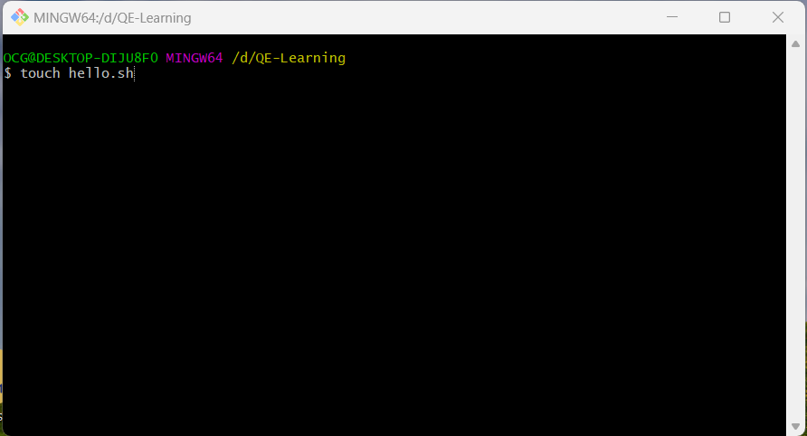
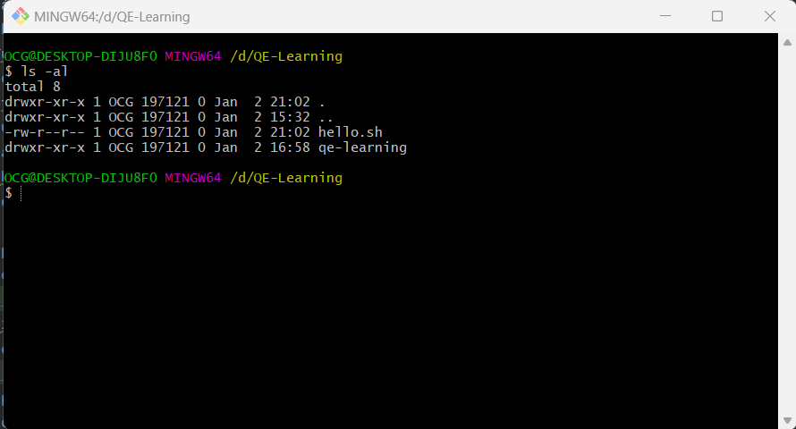
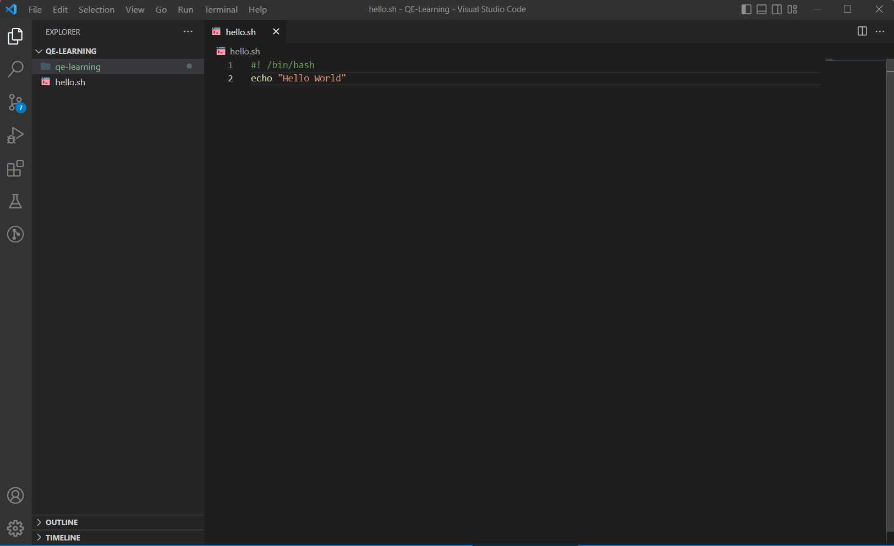
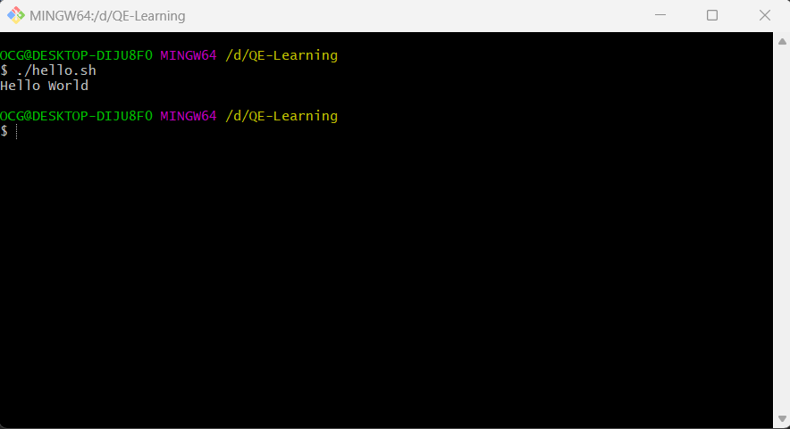

## Lesson 1: Introduction & getting started
- Shell là gì ?
    - Là diển giải các lệnh của người dùng, được người dùng nhập trực tiếp hoặc có thể được đọc từ file là shell scrips hoặc shell program.
    - Shell scrips không được biên dịch, nó được giải thích bởi hệ điều hành và bạn không cần biên dịch tập lệnh, hệ điều hành sẽ thực thi nó.
- Bash là gì ?
    - Bash (Bourne Again Shell) là một ngôn ngữ shell phổ biến nhất, được biết đến với sự kết hợp của các khả năng mạnh mẽ và hệ thống lệnh thân thiện với người dùng.
    - Bash không chỉ hoạt động trên Linux, mà cũng có sẵn trên macOS và BSD. Đặc biệt, bạn có thể sử dụng nó trên Windows thông qua tiện ích Windows Subsystem for Linux.
- Cài đặt git bash để dùng với hệ điều hành windows
Cách 1: Dùng tiện ích Windows Subsystem for Linux
    - Xem hướng dẫn tại: `https://learn.microsoft.com/en-us/windows/wsl/install`  
Cách 2: Dùng git bash
    - Step:
      - Download git bash tại: `https://git-scm.com/`
      - Install git bash 

### Bắt đầu với chương trình đầu tiên
- Step 1:
    - Open git bash create new  file
      Gõ lệnh: `touch hello.sh` > Create file `hello.sh`
       
    - Kiểm tra phân quyền file và thư mục trong Linux.
      Gõ lệnh `ls -al`
        - r: quyền đọc
        - w: quyền viết
        - x: quyền thực thi
      
    - 
- Step 2:
    - Open file với Visual Studio Code.
      Gõ lệnh: `code .` > Open file
      
- Step 3:
    - Viết chương trình đầu tiên với "Hello world"
      
- Step 4:
    - Run với terminal/git bash.
      Gõ lệnh: `./hello.sh`
              
