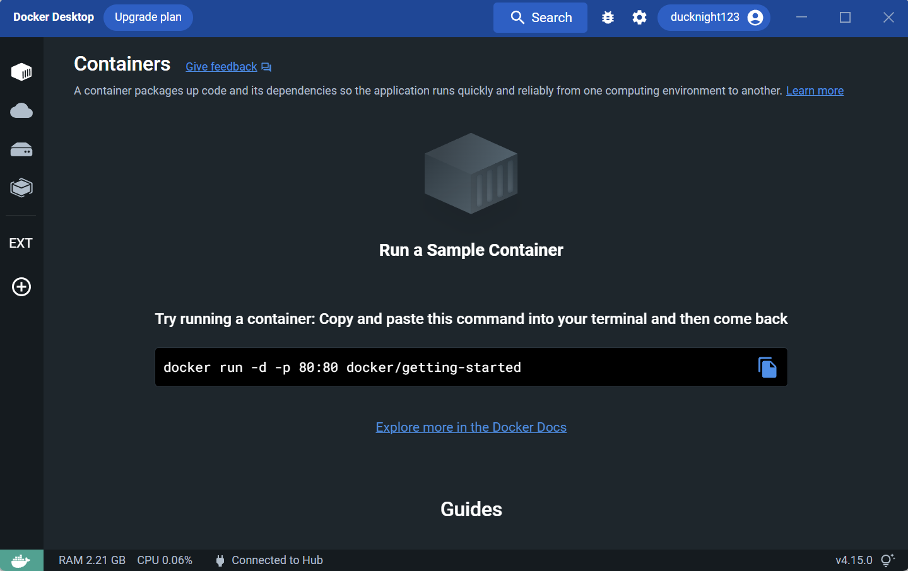

## Nghiên cứu về docker
	- Tổng quan
		- Docker là một trình ứng dụng giúp build hoàn chỉnh một app trên một máy tính với môi trường tương đương với sản phẩm (web app, server, app,...)
		- Docker bao gồm Dockerfile, Image và container 
		- Có thể thay thế cho VMware về tính nhỏ gọn, chiếm ít tài nguyên sử dụng của máy tính
		- Giúp đóng gói ứng dụng cùng với những dependencies cần thiết và các config đi kèm
		- Có thể share ứng dụng dưới dạng Image
	
	- Các khái niệm trong docker
		- Dockerfile: Là file dạng text không có đuôi mở rộng, chứa các câu lệnh (command) để thực thi, cấu trúc cho Image. Từ những câu lệnh trong dockerfile, docker sẽ builds ra một image
		- Image: là một file bất biến (read-only), trong đó có thể chứa các source code, libraries, dependencies, tools, config,... các file cần thiết để run một chương trình
		- Container: là một run-time environment mà ở đó người dùng có thể chạy một ứng dụng độc lập, đảm bảo cho ứng dụng hoạt động như nhau trong một môi trường giống nhau. Các container hoạt động độc lập nên chúng không bị ảnh hưởng đến nhau trong quá trình hoạt động
	
	- Các lệnh cơ bản trong docker
		- docker -v : Kiểm tra version của docker
		- docker ps : Kiểm tra container đang chạy trên máy
		- docker run: Khởi tạo container dựa trên một image
	
### Cài đặt và run docker
  - Windows/Mac: Version hiện tại đã có docker desktop
    1. Truy cập [link](https://docker.com) và click vào Download docker desktop
		2. Open và install file vừa tải về
		3. Giao diện của Docker desktop
		  
  
  - Linux: Sử dụng command và làm theo doc [link](https://docs.docker.com/desktop/install/linux-install/)