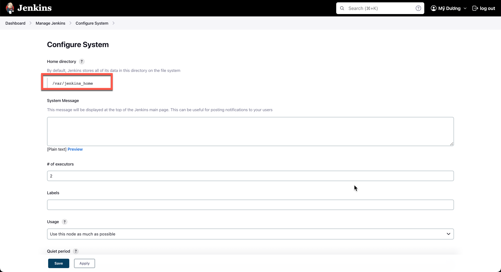

## Lesson 3: How to change Home Directory
- Lý do:
+ Chuyển Jenkins đến nơi có đủ dung lượng hơn
+ Project yêu cầu
- Cách thực hiện:
- Step 1: Check current home directory: 
+ Truy cập Jenkins:  Manage Jenkins -> Configure System 
+ kiểm tra Home directory: 
  

- Step 2: Tạo 1 thư mục mới trong doker container
- Step 3: Copy tất cả file sang thư mục mới
- Step 4: Thay đổi env variable JENKINS_HOME
  