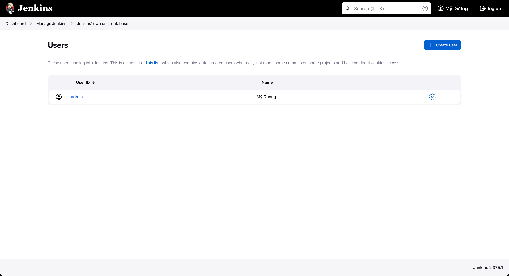
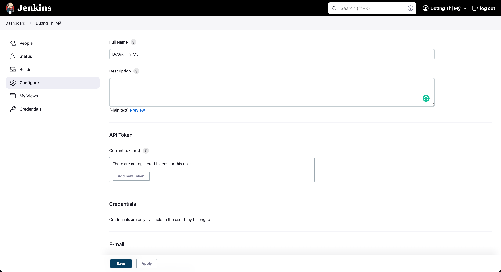
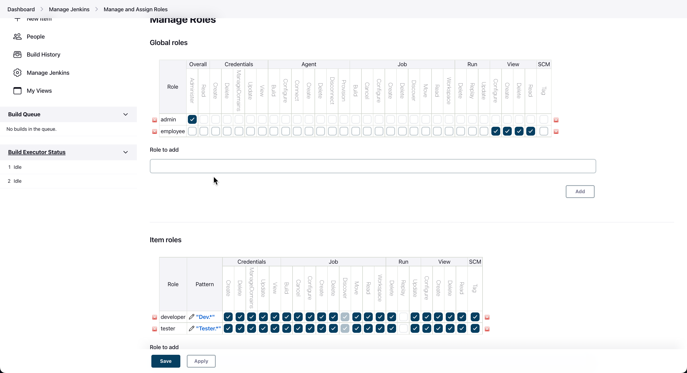
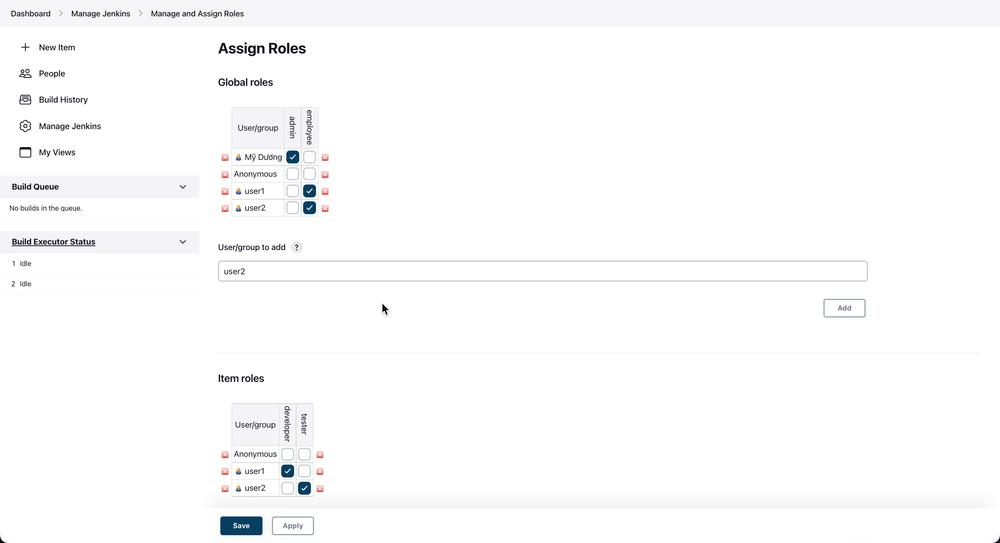

## Lesson 5: How to create Users + Manage + Assign Roles
### Create user
- Step 1: Manage Jenkins -> Manage Users

- Step 2: Click "Create User" > Nhập thông tin user
- Step 3: Có thể login bằng user vừa tạo
- Step 4: config user
 Chọn Configure > để thay đổi thông tin

- Step 5: Create and manage user roles
+ download Role-based Authorization Strategy plugin
+ login bằng acc admin > Manage Jenkins -> Configure Global Security -> Authorization > CHọn Role-based Strategy
+ login bằng acc user sẽ hiển thị Access Denied
- Step 6: Assign roles to users
+ Manage and Assign Roles > Manage Roles

+ Manage and Assign Roles > Assign Roles

