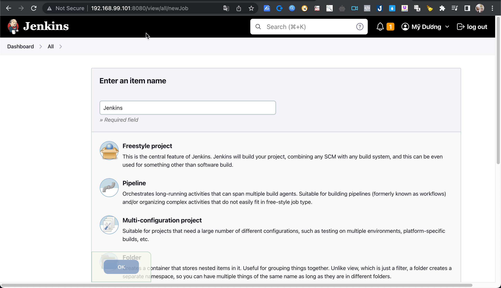
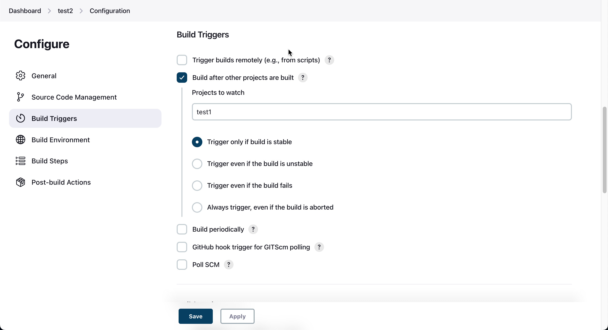
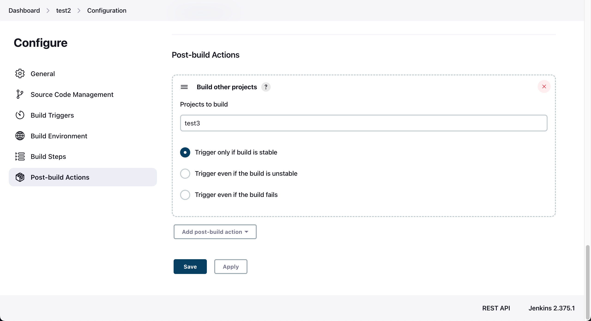

## Lesson 7: Getting started with JOBS

- Step 1: Open Jenkins > Click button "New Item" > Nhập thông tin detail


- Step 2. Trigger job remote
```http://localhost:8080/job/Jenkins/build?token=1234%20or%20/buildWithParameters?token=TOKEN_NAME```
- Step 3: chain job execution
+ Tạo job test1, test2, test3
+ Open config job test2 > Build Triggers > Build after other projects are built

+ Post-build Actions > Build other projects

- Step 4: Tại test1 > chọn Bulid Now => cả 3 job sẽ được chạy