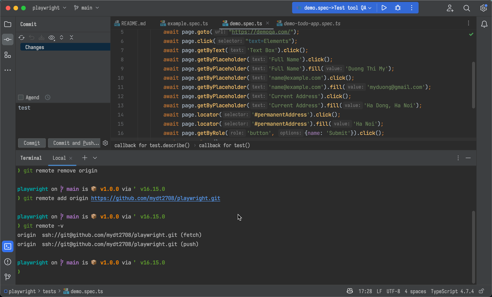
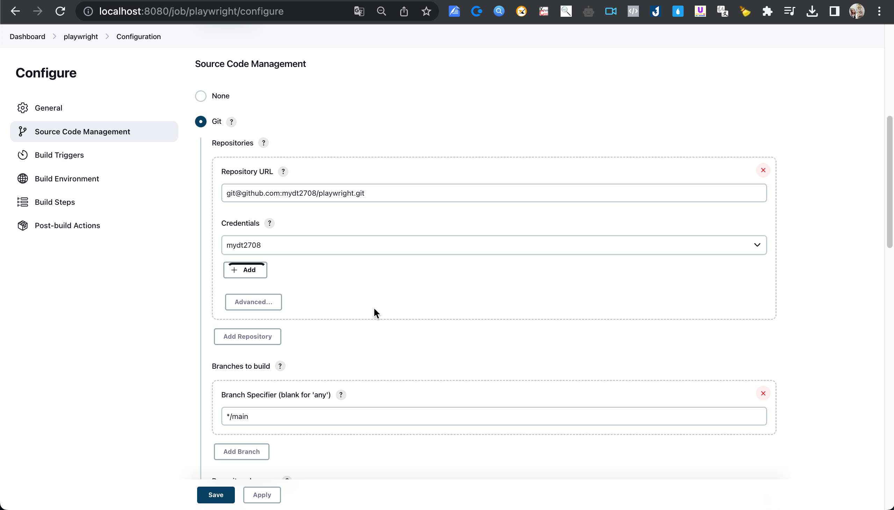
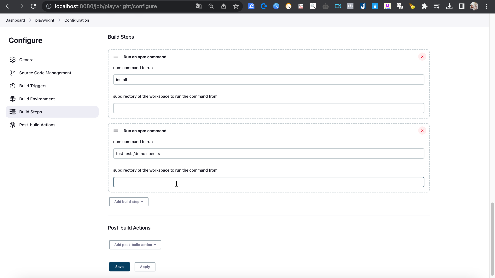
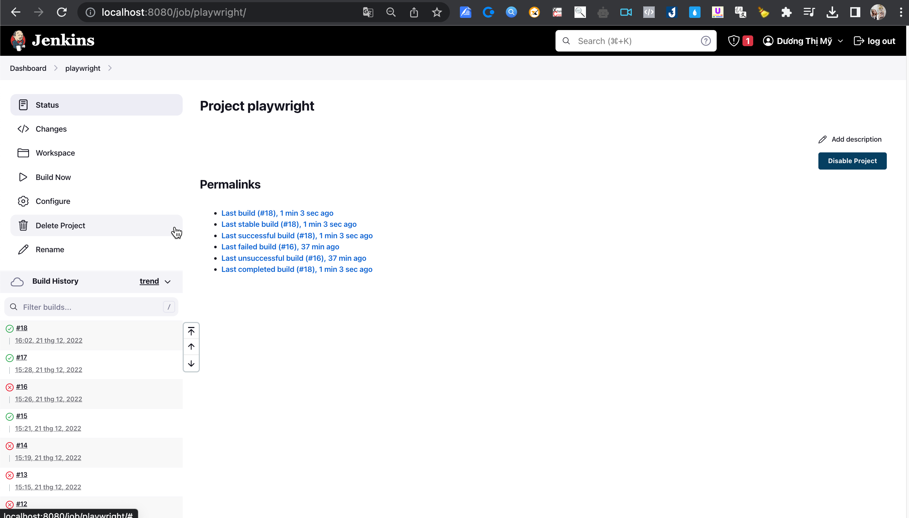

### Lesson 8:  Jenkins integration with GIT (SCM)
- Step 1: Tạo 1 project mới: 
(https://github.com/mydt2708/playwright)

- Step 2: Tạo job jenkins để build project: 
- Step 3: Config job jenkins
+ Source Code Management

+ Build Steps

- Step 4: Build job jenkins

