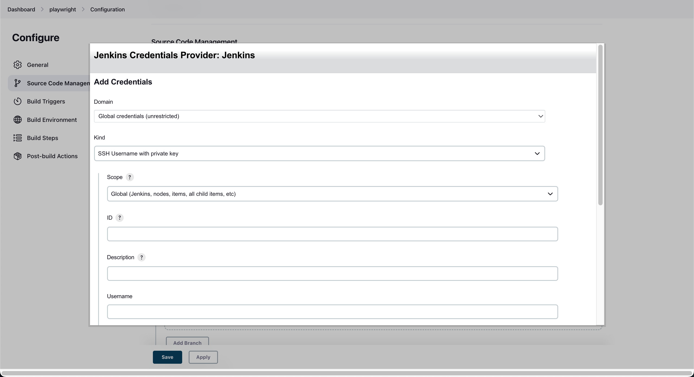

### Lesson 9: How to add GitHub Credentials
- Credential trên Jenkins là gi ?
+ Có rât nhiêu trang web và úng dụng của bên thú 3 có thể tương tác với Jenkins: docker registry, cloud storage, he thöng, dich vu, git,.. Vì vậy để có thể kết nối được các dịch vụ bên thứ 3 thì cần phải thao tác chứng thực (Credential) để tương tác với dịch vụ khác.
- Step 1: Tại màn Configure > Source Code Management > Chọn Git > Add > Add Credentials

- Step 2: Chọn Kind: SSH Username with private key > Nhập Username, Private Key > Add thành công
