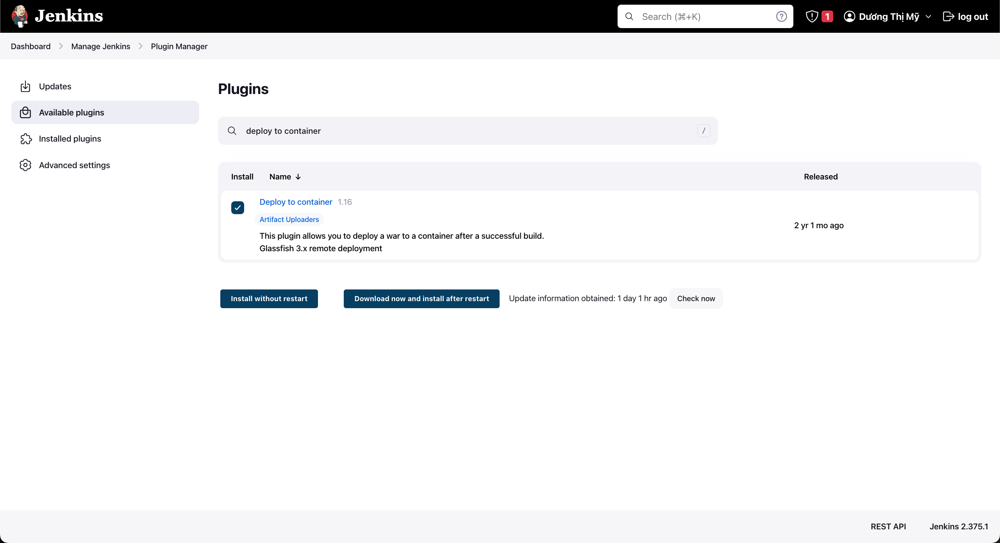

### Lesson 11, 12: What is Automated Deployment (Step by Step)
- Các giai đoạn chính:
+ Build: Tạo ra 1 bản build mới
+ Deploy: Deploy bản build mới lên môi trường
+ Test: Kiểm tra bản build mới có hoạt động đúng như mong đợi hay không
+ Release: Đưa bản build mới lên môi trường production
- Automated Deployment là gì ?
+ Là quá trình tự động hóa các bước build, deploy, test, release
- Step 1: Mở Jenkins
- Step 2: Install plugin: Deploy to container

- Step 3: Tạo job jenkins
- Step 4: Config job
+ Post-build Actions > Chọn Deploy war/ear to a container
- Step 5: Build job