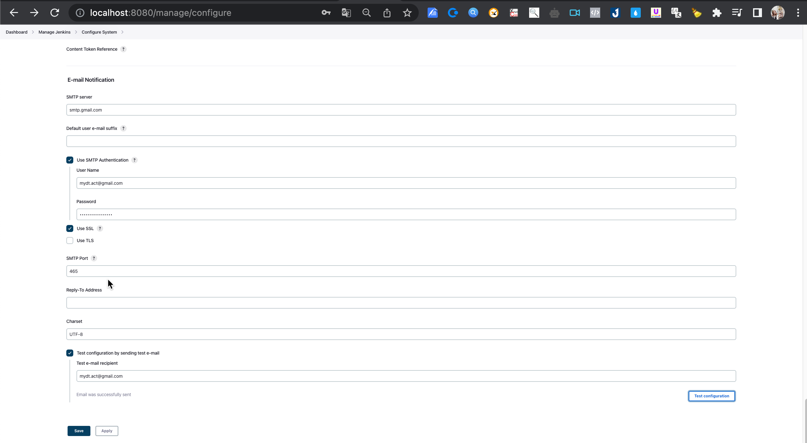
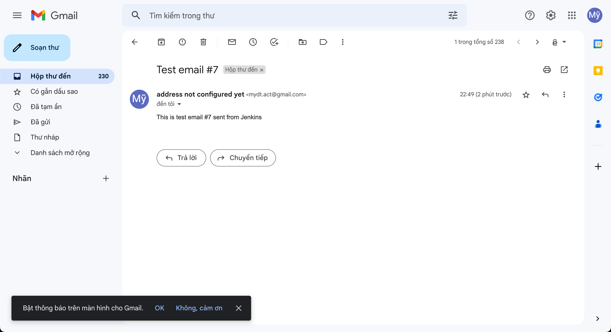

### Lesson 13: Notifications - How to send Email from Jenkins
- Step 1: Mở Jenkins > Manage Jenkins -> Configure System
- Step 2: Tại  E-mail Notification, chọn SMTP server
- Step 3: Thực hiện config

+ Tại Test configuration by sending test e-mail > Nhập email > Chọn Test Configuration > Hiển thị "Email was successfully sent" là được
+ Kiểm tra email thì hiển thị email test

- Step 4: Tại job > Configure > Post-build Actions > Chọn Send email notification > nhập Recipients
