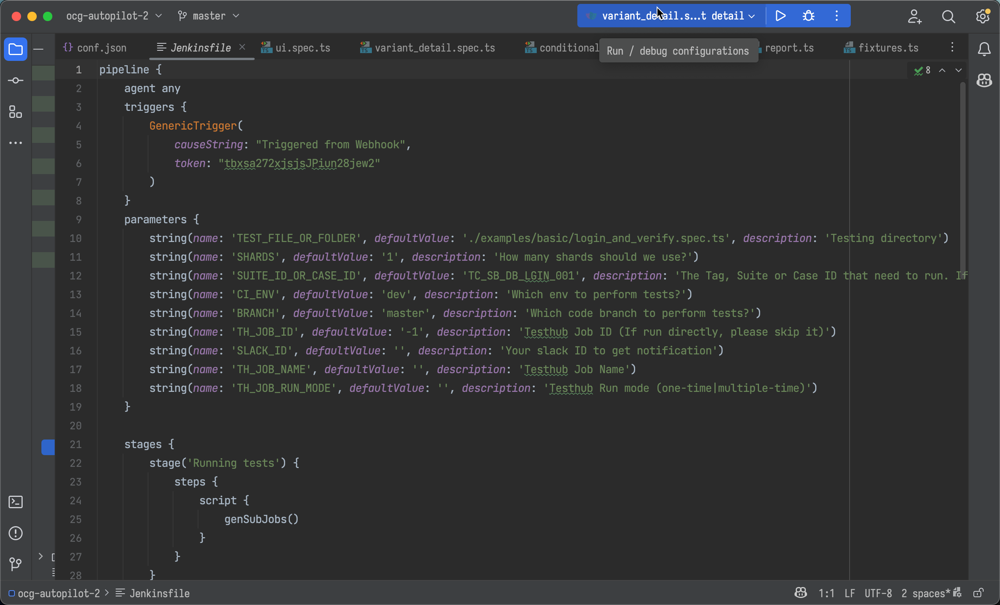

### Lesson 14: What is Pipeline in Jenkins (DevOps)

- Pipeline Jenkins là gì ?
 Jenkins Pipeline là một bộ plugin hỗ trợ việc triển khai và tích hợp CD theo kiểu pipeline (bao gồm tập hợp quy trình với các tác vụ liên quan với nhau và được thực hiện một cách tuần tự theo thứ tự đã quy định). Jenkins Pipeline được khai báo trên một tập tin được gọi là Jenkinsfile.
- Jenkinsfile là gì? 
 Jenkinsfile là phần “lõi” của Jenkins Pipeline, được viết dựa trên cú pháp của DSL (Domain Specific Language) với ngôn ngữ chính là: Groovy DSL. Tập tin này chứa danh sách các công việc mà pipeline sẽ thực hiện, được lưu trữ trên server Jenkins hoặc trên repository của git/Bitbucket.

VD tại repo: ocg-autopilot-2 (Jenkinsfile)

- Nội dung trong Jenkinsfile trên bao gồm:
+ Trường pipeline{} là thành phần bắt buộc dùng để khai báo pipeline trong Jenkinsfile.
+ Trường agent{} là thành phần bắt buộc dùng để khai báo agent (máy chủ) để thực hiện các công việc trong pipeline.
+ Trường triggers{} dùng để khai báo các trigger để thực hiện pipeline.
  + GenericTrigger: trigger dựa trên webhook
+ Trường parameters{} dùng để khai báo các tham số cần thiết cho pipeline.
+ Trường stages{} dùng để khai báo các “giai đoạn” (stage) con bên trong pipeline.
+ Trường genSubJobs{} dùng để khai báo các công việc cần thực hiện trong pipeline.

- Jenkinsfile này sẽ thực hiện các tác vụ sau:
+ Tạo parameter cho pipeline
+ Thực thi đoạn script được chỉ định.
``
yarn install
set +e
CI_ENV=${CI_ENV} yarn test ${TEST_FILE_OR_FOLDER} -g "${SUITE_ID_OR_CASE_ID}" --shard=${shardNum}/${SHARDS}
set -e
``
hoặc

``
yarn install
set +e
CI_ENV=${CI_ENV} yarn test ${TEST_FILE_OR_FOLDER} --shard=${shardNum}/${SHARDS}
set -e
``