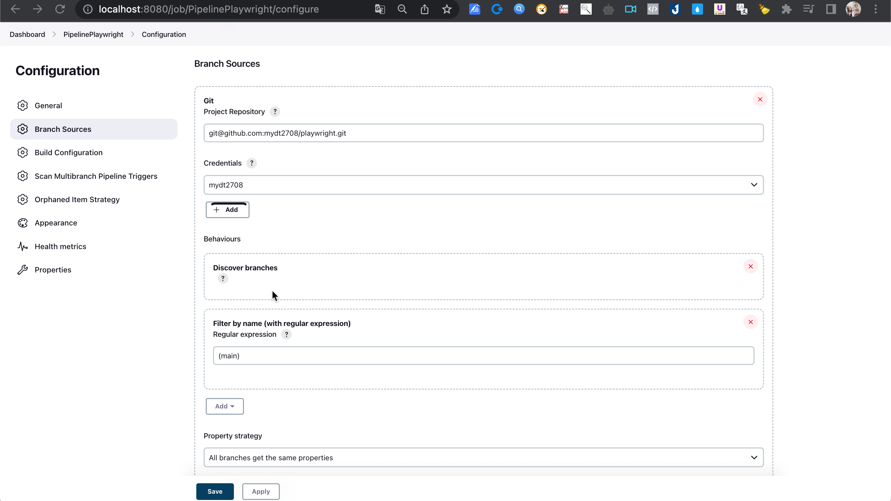
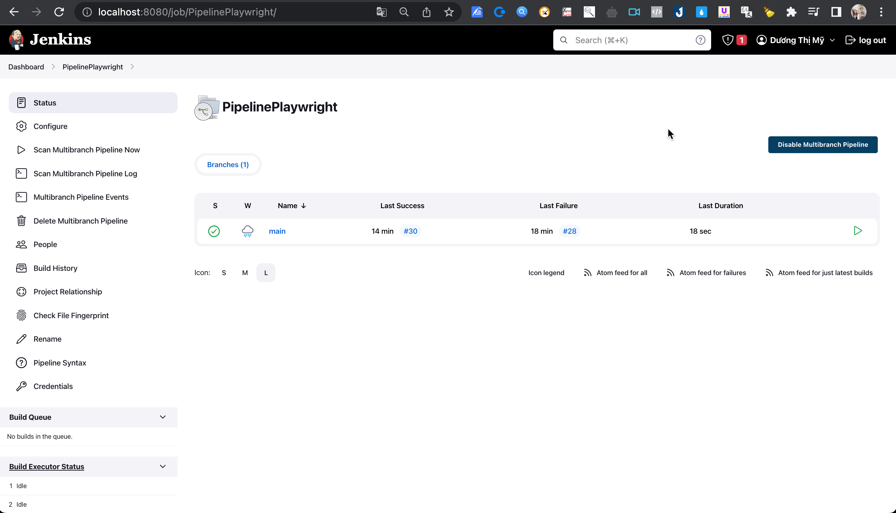
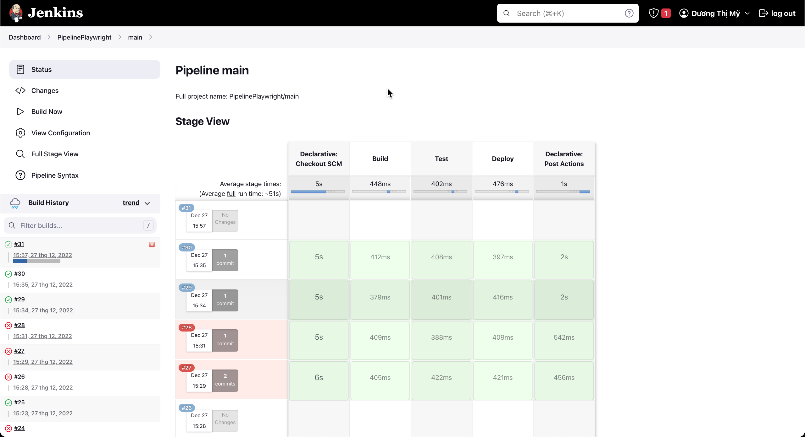
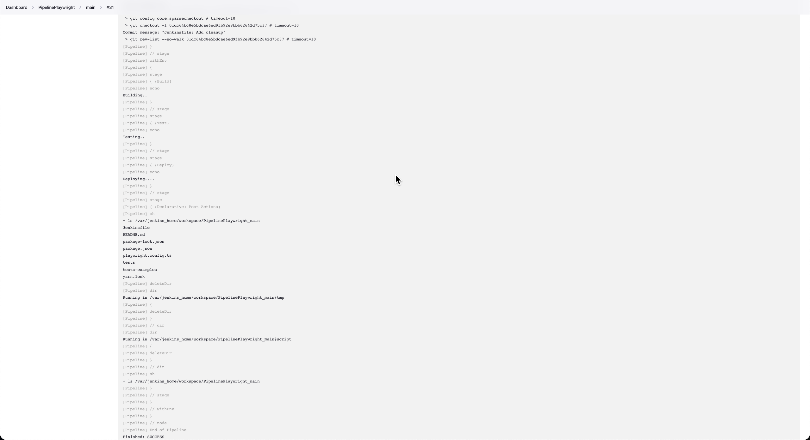

### Lesson 16: How to setup BUILD PIPELINE in Jenkins (Step by Step)

Link repo github: https://github.com/mydt2708/playwright
- Step 1: Mở Jenkins > New Item > Chọn Multibranch Pipeline
- Step 2: Thực hiện config
  + Tại Branch Sources > Add Project Repository > Credentials > Filter by name (with regular expression)

  

  + Tại Build Configuration > chọn by Jenkinsfile > Jenkinsfile

=> Sau khi config thành công chúng ta sẽ có giao diện như này:

- Step 3: Tạo file Jenkinsfile tại repo github : 

(jenkins/myduong/Jenkinsfile)

- Step 4: Tại Jenkins > click vào branch "manin" > click Build Now

- Step 5: Kiểm tra kết quả

