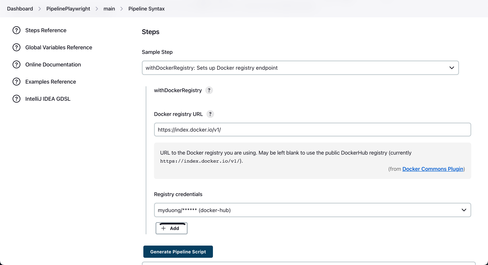

### Lesson 17: Build Docker Image và đẩy lên Docker Registry
Docker Registry là một dịch vụ máy chủ cho phép lưu trữ các docker image của cá nhân, công ty, team,… Dịch vụ Docker Registry có thể được cung cấp bởi tổ chức thứ 3 hoặc là dịch vụ nội bộ được xây dựng riêng nếu bạn muốn. Một số dịch vụ Docker Registry phổ biến như : Azure Container Registry.

- Tại Jenkins > Manage Jenkins > Manage Plugins > Available > tìm Docker pipeline > Install without restart
- Tại Pipeline > Chọn Pipeline syntax
- Tại Sample Step  > chọn `withDockerRegistry: Sets up Docker registry endpoint`

-> Click Generate Pipeline Script

- Add script vào Jenkinsfile > push code lên github

- Tại Jenkins > Build Now
